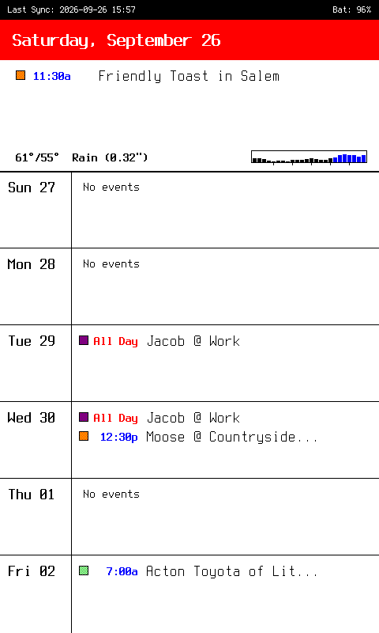

## Project Overview

<p align="center">

</p>

This software stack is designed to accompany my [Seeed EE04 + Spectra 7.3" model on Printables](https://www.printables.com/model/1826495-magnetic-seeed-ee04-spectra-73bw-75-e-ink-case).

How it works:

- On my home server, a Python app built into a Dockerfile that pulls events from my family's self-hosted Radicale calendar, plus local weather data for the day, and generates the 800x480 color calendar image as a .bmp. The dithered color squares allow a pretty accurate match for our different color-coded calendars. Handling dithering server-side and generating a pixel-perfect image for the Spectra 6 display vastly simplifies the EE04 code.

- The .ino sketch on the EE04 fetches the .bmp from the server once per day over HTTP and draws it on the E-Ink display. It also measures the battery voltage and appends this to the fetch request to display a battery percentage in the corner. Finally, the EE04 also receives the number of seconds until its next scheduled daily refresh before anybody wakes up for the day, and goes to deep sleep to conserve battery until then.

### Calendar event logic and weather

This should work with any CalDAV-compliant server (or raw .ics feed), but was only tested with Radicale. After being pointed to the CalDAV instance, whenever an HTTP GET request is sent to retrieve the calendar image, a 7 day rolling event calendar is generated.

Event start time is always displayed, otherwise the event is designated as "All Day." Multi-day events with an end time will have the end time designated on their final day. Significant testing was performed for edge cases involving recurring events (such as reschedules of recurring events or canceled single instances).

The calendar will always attempt to show 7 days of events unless it absolutely cannot. I implemented a smart scavenging system with the following logic:

1. All events for today should always be displayed.

2. Days with "No events" will have extra whitespace taken from them, breaking calendar symmetry but preserving the weekly view.

3. Once all whitespace has been scavenged, if extra space is required to show the soonest events, the furthest day will be dropped from the calendar. 

Weather is provided by Open-Meteo. Only the current day's weather will be shown. The calendar will show the daily high/low temperature, the "condition" for the day, and an hourly precipitation bar graph. Precipitation chance of 40% or more for any hour will render the bar in blue.

## Full Setup Instructions

### Setting Up the Calendar Image Server
1. Clone this repo to a folder named 'eink_calendar' while in your server's Docker project folder:
   ```
   git clone https://github.com/jacobdesforges/spectra6-eink-calendar.git eink_calendar
   ```
2. Rename .env.example to .env. Set the variables to reflect your CalDAV instance, weather information, and desired daily calendar update time.
3. Run `docker compose build` then `docker compose up -d`.
4. Navigate to http://YourServerIP:5233/calendar.bmp in a web browser to see the generated calendar image.

### Upload the sketch to your EE04 to fetch and print the calendar to your Spectra 6 7.3" display

[Assembly instructions for the hardware are on Printables](https://www.printables.com/model/1826495-magnetic-seeed-ee04-spectra-73bw-75-e-ink-case). 

1. Plug in the EE04 via USB-C to your computer.
2. Discover EE04 hardware address if it's your only serial device: `ls /dev/ttyUSB* /dev/ttyACM* 2>/dev/null`. Mine is at /dev/ttyACM0.
3. On Fedora and some other distros, your local user account cannot talk directly to hardware raw data tty nodes unless you are part of the hardware control group.
   Run the following user modification command so your account can execute raw writes over that port without needing root privileges:
   `sudo usermod -a -G dialout $USER`

   To apply, log out and back in, or run in the active terminal window `newgrp dialout`.
4. If you don't have arduino-cli, download and install it to your home bin directory:
   ```
   curl -fsSL https://raw.githubusercontent.com/arduino/arduino-cli/master/install.sh | BINDIR=~/bin sh
   ```
   Ensure it's working with `arduino-cli version`.
5. If you have multiple serial devices, can run `arduino-cli board list` now to find hardware address. 
6. Create a fresh config file: `arduino-cli config init`
7. Append the official ESP32 board manager package URL:
   ```
   arduino-cli config set board_manager.additional_urls https://espressif.github.io/arduino-esp32/package_esp32_index.json
   ```
8. Update the index files: `arduino-cli core update-index`
9. Install the core platform files for ESP32 (this replaces the graphical Board Manager): `arduino-cli core install esp32:esp32`
10. Allow install of libraries unvetted by official registry: `arduino-cli config set library.enable_unsafe_install true`
11. Install Seeed Tools: `arduino-cli lib install --git-url https://github.com/Seeed-Studio/Seeed_GFX`
12. In the ee04 folder, rename secrets.h.example to secrets.h and change the variables according to the instructions.
13. Still in ./ee04, compile the sketch targetting the XIAO ESP32-S3 platform and upload to the proper serial port:
   `arduino-cli compile --fqbn esp32:esp32:XIAO_ESP32S3:PSRAM=opi --upload -p /dev/ttyACM0 .`
14. If you get a compilation error for missing libraries, e.g. fatal error: # TFT_eSPI.h: No such file or directory, you need to install them:
   `arduino-cli lib install "TFT_eSPI"`
15. Unplug from USB-C.
16. The EE04 should execute on flash and grab the latest calendar image from your server. If you ever want to refresh it prior to the scheduled daily refresh, just hit the reset button on your EE04. 

### Common Issues:

#### Why does this use HTTP instead of HTTPS?

It's a design tradeoff for battery longevity. I wanted something that would sit on my fridge for months without needing recharging. Fetching an HTTPS resource on ESP32 boards consumes 2-3x as much battery as fetching an HTTP resource due to the network overhead and crypto processing for a TLS handshake. There is nothing secret about a calendar I've posted on my fridge for anybody to see, so there is nothing secret about that same .bmp being sent over the network when requested. Note that this is only the final generated .bmp served via HTTP; with proper Docker networking setup your CalDAV credentials are kept within the isolated virtual bridge network on your server.
